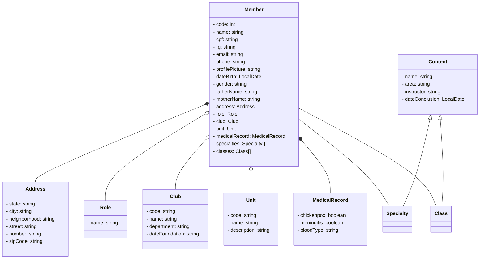

# Club Management System
A sytem to management a Pathfinder Club

## Class diagram

```mermaid
classDiagram
  class Member {
    - code: int
    - name: string
    - cpf: string
    - rg: string
    - email: string
    - phone: string
    - profilePicture: string
    - dateBirth: LocalDate
    - gender: string
    - fatherName: string
    - motherName: string
    - address: Address
    - role: Role
    - club: Club
    - unit: Unit
    - medicalRecord: MedicalRecord
    - specialties: Specialty[]
    - classes: Class[]
  }

  class Address {
    - state: string
    - city: string
    - neighborhood: string
    - street: string
    - number: string
    - zipCode: string
  }

  class Role {
    - name: string
  }

  class Club {
    - code: string
    - name: string
    - department: string
    - dateFoundation: string
  }

  class Unit {
    - code: string
    - name: string
    - description: string
  }

  class MedicalRecord {
    - chickenpox: boolean
    - meningitis: boolean
    - bloodType: string
  }

  class Content {
    - name: string
    - area: string
    - instructor: string
    - dateConclusion: LocalDate
  }

  class Specialty {
    
  }

  class Class {

  }

  Member *-- Address
  Member o-- Role
  Member o-- Club
  Member o-- Unit
  Member *-- MedicalRecord
  Member -- Specialty
  Member -- Class
  Content <|-- Specialty
  Content <|-- Class
```
